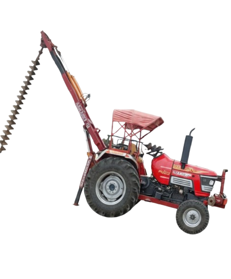

<!DOCTYPE html>
<html lang="en">
<head>
<meta charset="UTF-8">
<meta name="viewport" content="width=device-width, initial-scale=1.0">
<title>SS Piling | Professional Piling Contractors</title>

<!-- Google Font -->
<link href="https://fonts.googleapis.com/css2?family=Poppins:wght@300;400;600&display=swap" rel="stylesheet">

</head>

<body>

<header>
    <h1>SS Piling</h1>
    
Professional & Reliable Piling Contractors

    
    

    

    

</header>

<section>
    <h2>About Us</h2>
    

        SS Piling provides high-strength foundation piling solutions using modern
        machinery and experienced operators for residential and commercial projects.
    

</section>

<section>
    <h2>Our Services</h2>
    

        

            🏗️
            <h3>Foundation Piling</h3>
            
10–16 inch piling sizes

        

        

            📏
            <h3>Deep Drilling</h3>
            
10–16 feet depth

        

        

            🏠
            <h3>Residential Projects</h3>
            
Homes & villas

        

        

            🏢
            <h3>Commercial Projects</h3>
            
Shops & buildings

        

    

</section>

<section class="contact">
    <h2>Contact Us</h2>
    
📞 8817244740

    
📞 6264695978

    
📞 7898462167

    
📧 contact@sspiling.in

</section>

<section class="map">
    <h2>Our Location</h2>
    <iframe src="https://www.google.com/maps/embed?pb=!1m18!1m12!1m3!1d29342.7010075287!2d77.39565245024235!3d23.176125654633!2m3!1f0!2f0!3f0!3m2!1i1024!2i768!4f13.1!3m3!1m2!1s0x397c43710d34ab2f%3A0x1c8a40d7ef0f1a51!2sGehun%20Kheda%2C%20Madhya%20Pradesh!5e0!3m2!1sen!2sin!4v1769928430430!5m2!1sen!2sin"
    loading="lazy"></iframe>
</section>

<a class="whatsapp" href="https://wa.me/918817244740" target="_blank">
💬 WhatsApp
</a>

<footer>
    © 2026 SS Piling. All Rights Reserved.
</footer>

</body>
</html>
